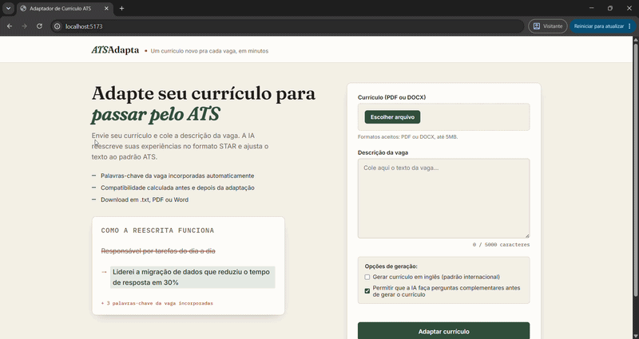
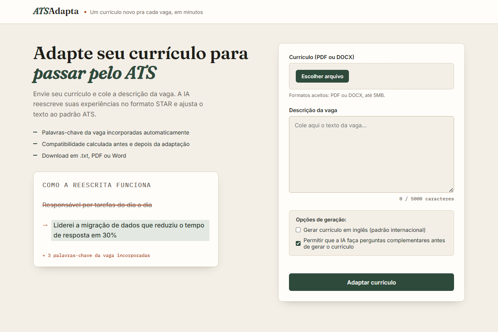
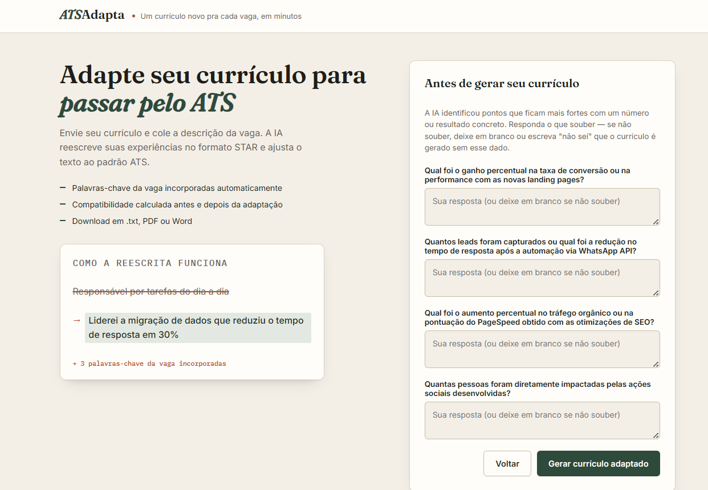
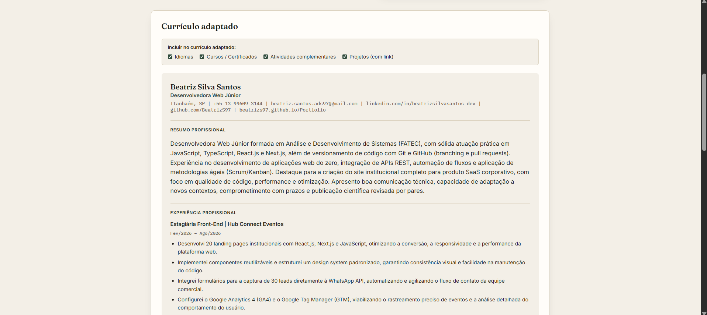
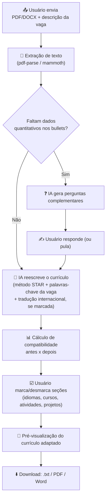
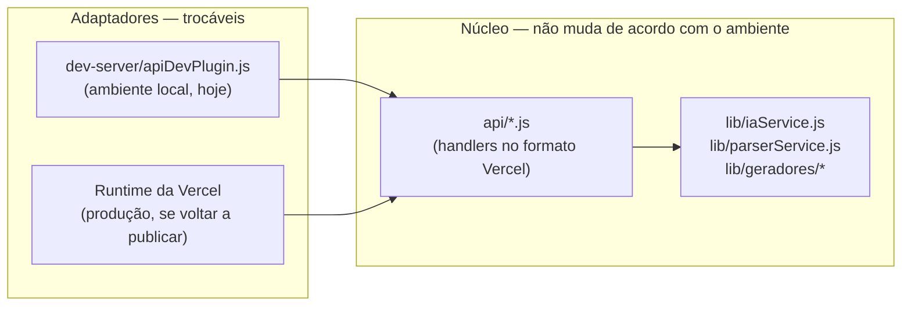

<div align="center">

# 📄 ATSAdapta

### Um currículo novo pra cada vaga, em minutos.

Envie seu currículo, cole a descrição da vaga e deixe a IA reescrever suas
experiências no formato **STAR**, adaptadas ao padrão **ATS** — pronto para
baixar em `.txt`, **PDF** ou **Word**.


</div>

<p align="center">
  
</p>

---

## 📚 Sumário

- [O que o projeto faz](#-o-que-o-projeto-faz)
- [Por que esse projeto existe](#-por-que-esse-projeto-existe)
- [Capturas de tela](#-capturas-de-tela)
- [Como funciona (fluxo)](#-como-funciona-fluxo)
- [Stack](#-stack)
- [Por que existe um apiDevPlugin.js](#-por-que-existe-um-dev-serverapidevpluginjs)
- [Estrutura do projeto](#-estrutura-do-projeto)
- [Como rodar localmente](#-como-rodar-localmente)
- [Testes automatizados](#-testes-automatizados)
- [Limitações conhecidas](#-limitações-conhecidas)
- [Perguntas frequentes](#-perguntas-frequentes)
- [Autoria e licença](#-autoria-e-licença)

---

## ✨ O que o projeto faz

O **ATSAdapta** recebe um currículo (**PDF** ou **DOCX**) e a descrição de
uma vaga e usa IA generativa para:

- 🎯 **Reescrever cada experiência no método STAR** (Situação, Tarefa, Ação,
  Resultado), sempre em voz ativa e primeira pessoa — nunca "Responsável
  por...".
- 🔑 **Incorporar as palavras-chave da vaga** naturalmente nos bullets e no
  resumo profissional, sem inventar experiências, empresas ou resultados.
- 📊 **Calcular a compatibilidade com a vaga**, antes e depois da
  adaptação, com as palavras-chave já cobertas e as que ainda faltam.
- ❓ **Perguntar por dados que faltam** (percentuais, prazos, quantidades)
  antes de gerar o currículo final, para que os resultados sejam reais —
  nunca inventados pela IA.
- 🌍 **Traduzir para inglês**, no padrão de currículo internacional, quando
  solicitado — com datas no formato MM/AAAA e verbos de ação no passado
  simples, prontos para vagas remotas ou fora do Brasil.
- ☑️ **Escolher o que entra no currículo final**, com checkboxes para incluir
  ou remover idiomas, cursos/certificados, atividades complementares e
  projetos antes do download — sem precisar editar o arquivo depois de
  gerado.
- ⬇️ **Exportar o resultado** em `.txt`, **PDF** ou **Word (.docx)**, prontos
  para envio.

## 🎯 Por que esse projeto existe

A ideia surgiu de um problema bem concreto. Uma vaga real de **Desenvolvedor(a)
React Júnior Remoto** (JavaScript, React, HTML, CSS e Git) pedia justamente o
tipo de adaptação manual que consome tempo: reescrever cada bullet no formato
certo, garantir que as palavras-chave da vaga apareçam e, por ser remota,
frequentemente exigir o currículo em inglês, no padrão internacional.

O ATSAdapta nasceu pra resolver esses pontos de uma vez: reescreve no método
STAR, incorpora as palavras-chave da vaga automaticamente, gera o currículo
já no formato internacional (datas MM/AAAA, verbos de ação no passado
simples) quando a vaga pede, e deixa o candidato escolher exatamente quais
seções entram na versão final antes de baixar — para que cada aplicação
fique enxuta e relevante para a vaga em questão.

## 🖼️ Capturas de tela

**Fluxo completo (upload → perguntas → resultado → download):**



<table>
  <tr>
    <td align="center" width="33%">
      <br />
      <sub>Tela inicial</sub>
    </td>
    <td align="center" width="33%">
      <br />
      <sub>Perguntas complementares</sub>
    </td>
    <td align="center" width="33%">
      <br />
      <sub>Resultado e compatibilidade</sub>
    </td>
  </tr>
</table>

### Como atualizar as capturas de tela

1. Rode o projeto localmente: `npm run dev`
2. Tire os prints (Windows: `Win + Shift + S`) das telas: inicial, perguntas
   complementares e resultado adaptado.
3. Grave um GIF do fluxo completo (upload → perguntas → resultado →
   download) com o [ScreenToGif](https://www.screentogif.com/) (Windows) ou
   [Kap](https://getkap.co/) (Mac).
4. Salve os arquivos em `docs/screenshots/`, com os mesmos nomes já usados
   acima (`tela-inicial.png`, `perguntas-complementares.png`,
   `resultado-adaptado.png`, `demo.gif`) para não precisar editar os links.

## 🔄 Como funciona (fluxo)



## 🛠️ Stack

| Camada | Tecnologia |
|---|---|
| Frontend | React 18 + Vite |
| Backend | Funções no formato serverless (`api/`), servidas localmente por um plugin do próprio Vite (`dev-server/`) |
| IA | Google Gemini API (tier gratuito) |
| Geração de PDF | [`pdfkit`](https://www.npmjs.com/package/pdfkit) |
| Geração de Word | [`docx`](https://www.npmjs.com/package/docx) |
| Extração de texto | [`pdf-parse`](https://www.npmjs.com/package/pdf-parse) + [`mammoth`](https://www.npmjs.com/package/mammoth) |
| Testes | [`jest`](https://jestjs.io/) + [`@testing-library/react`](https://testing-library.com/docs/react-testing-library/intro/) |

## 🧩 Por que existe um `dev-server/apiDevPlugin.js`?

O projeto usa funções no formato **serverless** (`api/*.js`, com a
assinatura `export default function handler(req, res)`), pensadas para
rodar em plataformas como a Vercel. Como o projeto, por enquanto, roda
apenas localmente, havia duas formas de resolver isso:

**Opção A — Reescrever `api/` no formato do Vite/Express.**
Mais direta, mas acopla a lógica de negócio (extração de texto, chamada à
IA, geração de PDF/Word) à ferramenta que a executa. Se um dia o projeto
precisar rodar em outra plataforma (Vercel de novo, outra função
serverless, um servidor Express tradicional), a lógica precisaria ser
reescrita — e mantida em duas versões enquanto isso não acontecesse.

**Opção B — Um adapter que "traduz" o ambiente do Vite para o formato que os handlers já esperam (a escolhida).**
`dev-server/apiDevPlugin.js` não contém nenhuma regra de negócio: ele só
adiciona ao `res` os métodos que a Vercel adicionaria em produção
(`res.status()`, `res.json()`, `res.send()`) e repassa a chamada para o
handler original, sem alterá-lo. Os arquivos de `api/` e `lib/` continuam
exatamente como estavam — eles não sabem (nem precisam saber) se quem os
está chamando é o Vite, a Vercel ou qualquer outro ambiente.

Isso segue o mesmo princípio da **arquitetura em portas e adaptadores
(hexagonal)**: o núcleo da aplicação (`api/` + `lib/`) fica isolado de
detalhes de infraestrutura, e a "casca" que o expõe para fora é trocável
sem tocar no núcleo.



## 🗂️ Estrutura do projeto

```
curriculo-ats/
├── api/
│   ├── perguntas.js         → extrai o texto e pede perguntas complementares à IA
│   ├── adaptar.js           → adapta o currículo à vaga (método STAR)
│   └── gerar-arquivo.js     → gera o PDF ou DOCX final para download
├── lib/
│   ├── parserService.js     → extrai texto de PDF/DOCX enviados
│   ├── iaService.js         → monta os prompts e chama a API do Gemini
│   ├── arquivoService.js    → ponto de entrada para geração de arquivos
│   └── geradores/
│       ├── formatadores.js  → helpers de formatação compartilhados
│       ├── pdfGerador.js    → geração do PDF (pdfkit)
│       └── docxGerador.js   → geração do Word (docx)
├── src/
│   ├── App.jsx
│   ├── App.css
│   ├── main.jsx
│   ├── components/
│   │   ├── FormularioCurriculo.jsx
│   │   ├── PerguntasComplementares.jsx
│   │   ├── ResultadoCurriculo.jsx
│   │   ├── CompatibilidadeVaga.jsx
│   │   ├── OpcaoTraducaoInternacional.jsx
│   │   ├── OpcaoPerguntasComplementares.jsx
│   │   ├── DownloadModal.jsx
│   │   └── ToastContainer.jsx
│   └── styles/
│       └── *.css             → um arquivo por área da interface
├── dev-server/
│   └── apiDevPlugin.js       → plugin do Vite que roda api/ localmente (substitui o "vercel dev")
├── tests/                    → testes unitários e de componentes (Jest)
├── docs/screenshots/         → prints e GIF usados neste README
├── CASOS_DE_TESTE.md          → roteiro de testes manuais ponta a ponta
├── LICENSE                    → termos de uso do projeto
├── index.html
├── vite.config.js
└── package.json
```

## 🚀 Como rodar localmente

O projeto roda **inteiramente com `npm run dev`**, sem precisar de nenhuma
ferramenta externa (não é preciso instalar a CLI da Vercel). As funções da
pasta `api/` (extração de texto, chamada da IA e geração de PDF/Word) rodam
dentro do próprio servidor do Vite, através de um plugin local
(`dev-server/apiDevPlugin.js`) que expõe essas rotas na mesma porta do
frontend.

```bash
# 1. Instale as dependências
npm install

# 2. Configure a chave da API do Gemini (gratuita)
cp .env.example .env
```

1. Acesse [aistudio.google.com/apikey](https://aistudio.google.com/apikey)
2. Faça login com uma conta Google
3. Clique em **"Create API Key"**
4. Cole a chave no `.env`, na variável `GEMINI_API_KEY`

```bash
# 3. Rode o projeto
npm run dev
```

Isso sobe o frontend e as rotas de `api/` juntos em `http://localhost:5173`.

> ⚠️ Alterações dentro de `api/` ou `lib/` exigem reiniciar o
> `npm run dev` para valerem (essas rotas são carregadas uma única vez,
> na subida do servidor). O frontend (`src/`) continua com hot-reload
> normal do Vite.

## ✅ Testes automatizados

O projeto usa **Jest** para testes unitários da geração de arquivos
(`lib/`) e **React Testing Library** para os fluxos de componentes
(`src/components/`).

```bash
npm test          # roda toda a suíte uma vez
npm run test:watch  # roda em modo observação (watch)
```

O que é coberto:

- ✅ `formatadores.js` — junção de textos, pontuação e detecção de
  e-mail/link nos dados de contato.
- ✅ `pdfGerador.js` e `docxGerador.js` — geração de arquivos válidos
  (`.pdf` / `.docx`) para currículos mínimos e completos, em português e
  inglês, sem lançar exceção.
- ✅ `arquivoService.js` — ponto de entrada usado por `api/gerar-arquivo.js`.
- ✅ `parserService.js` — roteamento correto entre `pdf-parse` e `mammoth`
  conforme o mimetype do arquivo enviado.
- ✅ `iaService.js` — validação de configuração (erro claro quando falta
  `GEMINI_API_KEY`).
- ✅ `FormularioCurriculo.jsx` — validações de arquivo/descrição da vaga e
  envio das opções corretas (tradução e perguntas complementares).
- ✅ `App.jsx` — rolagem da página: para o topo ao surgir as perguntas
  complementares e para o início do currículo adaptado ao concluir a
  geração.

Para o roteiro de testes manuais (fluxos que dependem de rodar a aplicação
de verdade no navegador), veja **[`CASOS_DE_TESTE.md`](./CASOS_DE_TESTE.md)**.

## ⚠️ Limitações conhecidas

- PDFs escaneados (imagem, sem texto selecionável) não são suportados.
- Não há banco de dados: nada é salvo entre sessões.
- O PDF/Word gerado usa formatação simples (texto corrido), propositalmente,
  pois layouts complexos prejudicam a leitura por sistemas ATS.
- O limite de tamanho do arquivo enviado é 5MB.
- Projeto roda apenas localmente por enquanto; não há ambiente publicado.

## ❓ Perguntas frequentes

<details>
<summary><strong>A IA pode inventar experiências ou resultados que não estão no meu currículo?</strong></summary>
<br>
Não. As regras de prompt (ver <code>lib/iaService.js</code>) proíbem
explicitamente inventar empresas, cargos, projetos, links ou resultados
numéricos. Quando falta um número para comprovar um resultado, o sistema
pergunta ao candidato em vez de inventar.
</details>

<details>
<summary><strong>Por que às vezes aparecem perguntas antes de gerar o currículo?</strong></summary>
<br>
Sempre que um bullet descreve um resultado sem número, prazo ou percentual
que o comprove, a IA pergunta esse dado ao candidato — assim o currículo
final não sai com dados inventados. Isso pode ser desativado na opção
"Permitir que a IA faça perguntas complementares".
</details>

<details>
<summary><strong>O PDF sempre sai em 1 página?</strong></summary>
<br>
O gerador tenta várias escalas de fonte/espaçamento até o conteúdo caber em
uma única página. Currículos muito extensos podem, ainda assim, ocupar mais
de uma página quando nenhuma escala testada é suficiente.
</details>

<details>
<summary><strong>Preciso instalar a CLI da Vercel para rodar o projeto?</strong></summary>
<br>
Não. O projeto roda inteiramente com <code>npm run dev</code>. As rotas de
<code>api/</code> são servidas localmente por um plugin do próprio Vite
(<code>dev-server/apiDevPlugin.js</code>), que expõe essas mesmas funções na
porta do frontend — sem depender de nenhuma ferramenta externa.
</details>

<details>
<summary><strong>Consigo escolher quais seções aparecem no currículo final?</strong></summary>
<br>
Sim. Na tela de resultado, checkboxes permitem incluir ou remover idiomas,
cursos/certificados, atividades complementares e projetos antes de copiar ou
baixar o arquivo — sem precisar editar manualmente depois.
</details>

## ©️ Autoria e licença

Projeto idealizado e desenvolvido por **Beatriz Silva Santos**.

> © 2026 Beatriz Silva Santos. Todos os direitos reservados.
>
> Este repositório é disponibilizado publicamente **apenas para fins de
> consulta e avaliação de portfólio**. Não é permitido copiar, redistribuir,
> reutilizar trechos de código, prompts de IA ou a estrutura deste projeto
> — total ou parcialmente, com ou sem fins comerciais — sem autorização
> prévia e por escrito da autora. Veja os termos completos em
> [`LICENSE`](./LICENSE).

GitHub: [`@BeatrizS97`](https://github.com/BeatrizS97) · LinkedIn: [linkedin.com/in/beatrizsilvasantos-dev](https://www.linkedin.com/in/beatrizsilvasantos-dev)

---

<div align="center">

Feito com 🌿 para quem só quer aplicar pra vaga sem reescrever o currículo do zero.

</div>
